# Welcome to Pandoc PPTX Demo

This presentation demonstrates the complete workflow for creating professional PowerPoint presentations from Markdown using Pandoc.

**Key Features Covered:**
- Markdown to PPTX conversion
- Automatic mermaid diagram rendering
- Corporate template styling
- Text sizing and layout optimization
- Column layouts and content organization

---

# Getting Started

## Prerequisites
- Pandoc (document converter)
- mermaid-cli (diagram generation)
- Python with panflute (pandoc filters)

## Quick Start
```bash
# Build presentation
./build.sh

# Output: presentation-demo.pptx
```

---

# Basic Markdown Features

:::: {.columns}

::: {.column width="50%"}
## Text Formatting

**Bold text** for emphasis

*Italic text* for details

`Code snippets` for technical terms

> Blockquotes for important notes

### Lists Work Great:
- Bullet point one
- Bullet point two
- Bullet point three
:::

::: {.column width="50%"}
## Tables and Data

| Metric | Q3 | Q4 | Change |
|--------|----|----|--------|
| Revenue | $11.2M | $11.5M | +2.7% |
| Users | 45K | 52K | +15.6% |
| Growth | 12% | 18% | +50% |

**Key Insight:** Consistent growth across all metrics demonstrates strong business performance.
:::

::::

---

# Mermaid Diagrams - Basic Sizing

:::: {.columns}

::: {.column width="50%"}
### Small Diagram (400x300)


**Perfect for:** Simple flows, icons, dashboard widgets
:::

::: {.column width="50%"}
### Medium Diagram (600x400)


**Ideal for:** Standard presentations, process flows
:::

::::

---

# Complex System Architecture

### Full-Width Architecture Diagram (1000x600)


**Use Case:** Technical presentations, system overviews, architecture reviews

---

# Project Timeline with Gantt Charts

### Development Schedule (900x400)


**Benefits:** Clear timeline visualization, milestone tracking, resource planning

---

# Multiple Small Diagrams in Columns

:::: {.columns}

::: {.column width="25%"}
#### System Status (200x150)

:::

::: {.column width="25%"}
#### Performance (200x150)

```mermaid {width="200" height="150"}
graph TD
    A[API] --> B[✅ Fast]
    style B fill:#4caf50
```

:::

::: {.column width="50%"}
#### Key Performance Indicators

**System Metrics:**
- **Uptime**: 99.9% (Target: 99.5%)
- **Response Time**: 120ms (Target: <200ms)
- **Error Rate**: 0.1% (Target: <0.5%)
- **Throughput**: 1,500 req/sec

**Business Metrics:**
- **Active Users**: 50,000+ daily
- **Conversion Rate**: 3.2% (up 0.8%)
- **Customer Satisfaction**: 4.7/5
:::

::::

---

# Theme Variations

:::: {.columns}

::: {.column width="50%"}
### Dark Theme

:::

::: {.column width="50%"}
### Forest Theme

:::

::::

**Theme Options:** `default`, `dark`, `forest`, `neutral`

---

# Sequence Diagrams for Process Flow

### API Interaction Flow (800x500)


**Perfect for:** API documentation, workflow explanation, system interactions

---

# Text Sizing Best Practices

## Content Hierarchy Strategy

:::: {.columns}

::: {.column width="60%"}
### ✅ Optimized Content Structure

**Executive Summary** (H3 level)
- Key point with **bold emphasis**
- Supporting detail in regular text
- *Additional context in italics*

**Strategic Initiatives** (H3 level)
- Market expansion efforts
- Product innovation pipeline
- Operational efficiency gains

**Next Steps** (H3 level)
- Q1: Launch new features
- Q2: Enter European market
- Q3: Scale operations

*Note: Use hierarchy instead of manual font sizing*
:::

::: {.column width="40%"}
### ❌ Avoid Dense Content

Long paragraphs with too much information crammed into a single bullet point make slides difficult to read and understand quickly. This approach overwhelms the audience and reduces the effectiveness of your presentation. 

Instead, break content into:
- Concise bullet points
- Clear hierarchical structure
- Visual breathing room
- Focused messaging

**Result:** Better engagement and comprehension
:::

::::

---

# Corporate Template Integration

## PowerPoint Template Workflow

:::: {.columns}

::: {.column width="50%"}
### Template Setup Process

1. **Create Reference Document**
   - Design in PowerPoint
   - Set slide masters
   - Define color schemes
   - Save as `template.pptx`

2. **Use in Pandoc**
   ```bash
   pandoc presentation.md \
     --reference-doc template.pptx \
     -o output.pptx
   ```

3. **Automatic Styling**
   - Headers use master layouts
   - Colors applied automatically
   - Fonts follow template
   - Consistent branding
:::

::: {.column width="50%"}
### Template Benefits

**Brand Consistency:**
- Corporate colors
- Standard fonts
- Logo placement
- Professional layout

**Time Savings:**
- No manual formatting
- Reusable templates
- Automated styling
- Focus on content

**Quality Control:**
- Consistent appearance
- Professional standards
- Error reduction
- Team alignment
:::

::::

---

# Advanced Features Summary

## Comprehensive Capabilities

### Document Features ✅
- **Headers & Text**: Full markdown syntax support
- **Lists**: Bullets, numbers, nested structures
- **Tables**: Data presentation with styling
- **Code Blocks**: Syntax highlighting support
- **Math**: LaTeX equations (where supported)

### Diagram Features ✅
- **Flowcharts**: Process flows, decision trees
- **Sequence Diagrams**: API flows, interactions
- **Gantt Charts**: Project timelines, scheduling
- **Pie Charts**: Data visualization, percentages
- **Architecture**: System diagrams, components

### Layout Features ✅
- **Columns**: Multi-column layouts
- **Sizing**: Custom width/height control
- **Themes**: Visual consistency options
- **Templates**: Corporate branding support
- **Responsive**: Adaptive content sizing

---

# Quick Reference

## Essential Syntax

### Basic Markdown
```markdown
# Slide Title
## Section Header
**Bold text**
*Italic text*
- Bullet points
```

### Columns
```markdown
:::: {.columns}
::: {.column width="50%"}
Left content
:::
::: {.column width="50%"}
Right content
:::
::::
```

### Mermaid Diagrams
```markdown

```

### Build Command
```bash
pandoc presentation.md \
  --filter ./mermaid-filter.py \
  --reference-doc template.pptx \
  -o output.pptx
```

---

# Resources & Next Steps

## What You Get
- ✅ Professional PowerPoint presentations
- ✅ Automatic diagram generation
- ✅ Corporate template support
- ✅ Version control friendly
- ✅ Repeatable build process

## Customization Options
- **Templates**: Modify `template.pptx` for branding
- **Themes**: Adjust mermaid diagram themes
- **Sizing**: Optimize for your content needs
- **Layout**: Customize column arrangements

## Getting Started
1. Clone this repository
2. Install dependencies: `uv sync`
3. Customize `template.pptx` for your brand
4. Edit `presentation-demo.md` with your content
5. Run `./build.sh` to generate your presentation

**Happy presenting!** 🎉📊✨
